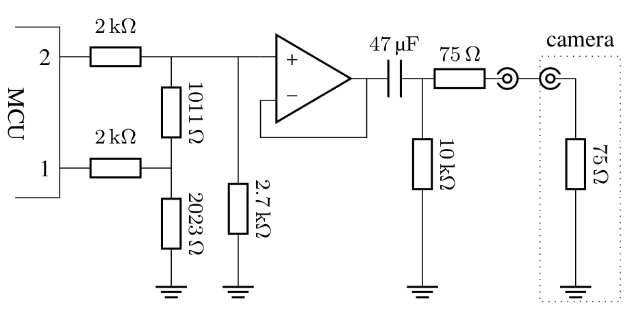

# Tri-Level Sync Generation based on a PTP-synchronized clock with the Teensy 4.1

This [repository](https://github.com/IMS-AS-LUH/t41-tri-sync-ptp) provides the source code for our research paper "PTP-Synchronized Tri-Level Sync Generation for Networked Multi-Sensor Systems" ([Published Article](https://doi.org/10.1109/RTCSA62462.2024.00022)). This Arduino compatible library has been created to provide a Tri-Level Sync signal generation based on a PTP-Synchronized clock for the Teensy 4.1 microcontroller platform.

This library was created by the Architectures and Systems Group of the Institute of Microelectronic Systems ([IMS/AS](https://www.ims.uni-hannover.de/de/institut/architekturen-und-systeme/)) at the [Leibniz University](https://www.uni-hannover.de) in Germany.

## Getting Started

### Prerequisites

_(based on the [ptp library](https://github.com/IMS-AS-LUH/t41-ptp))_

- Teensy 4.1 with Ethernet adapter
- Working Teensy Arduino environment
- PTP-branch of QNEthernet Library with our patches: https://github.com/HedgeHawk/QNEthernet/tree/ieee1588-2-fix

### Installation

- Clone the library folder to your Arduino-libraries path
- Restart Arduino IDE

### Examples

Additionally to the PTP Slave and PTP Master example of the base repository, an extra example is provided for the generation of the Tri-Level Sync signal generation.

### Board Setup

The signal generation requires an extra electrical network connected to the microcontroller. The schematic can be seen here:

The lower and higher pin for the example are pin 10 and 12.

## Citation

If you use our Tri-Level Sync library (or parts of it) in scientific work, please cite our paper:

```
@INPROCEEDINGS{10695636,
  author={Riggers, Christoph and Schleusner, Jens and Renke, Oliver and Blume, Holger},
  booktitle={2024 IEEE 30th International Conference on Embedded and Real-Time Computing Systems and Applications (RTCSA)},
  title={PTP-Synchronized Tri-Level Sync Generation for Networked Multi-Sensor Systems},
  year={2024},
  pages={91-96},
  keywords={Time-frequency analysis;Protocols;SMPTE;Cameras;Signal generators;Software;Real-time systems;Synchronization;Frequency control;Clocks;Precision Time Protocol;PTP;Tri-Level Sync;camera;SMPTE;PI-controller;synchronization;MCU},
  doi={10.1109/RTCSA62462.2024.00022}}
```

This work is based on the [ptp library](https://github.com/IMS-AS-LUH/t41-ptp). If you are using the
PTP functionality of this repository, cite them accordingly.

## License

Distributed under the MIT license. Please see LICENSE for more information.
